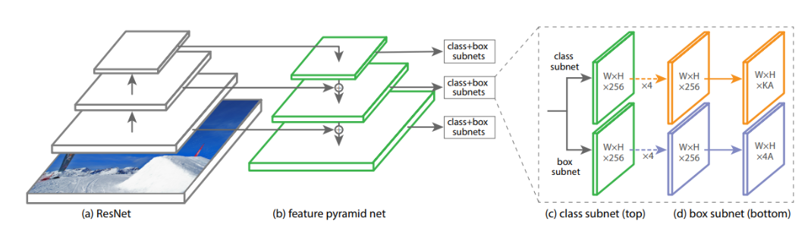

### Object-Detection
It is a technique of computer vision and image processing that deals with detecting instances of semantic objects of a certain class such as humans, buildings and cars in digital images and videos.
### Requirements
* Keras 2.x
* Python 3.x
* Tensorflow 1.x
### Folder Structure
├── __Code__     
│ &nbsp;&nbsp;&nbsp;&nbsp;&nbsp;&nbsp;&nbsp;&nbsp;└── UNET.ipynb  
│ &nbsp;&nbsp;&nbsp;&nbsp;&nbsp;&nbsp;&nbsp;&nbsp;└── Segnet.ipynb    
│ &nbsp;&nbsp;&nbsp;&nbsp;&nbsp;&nbsp;&nbsp;&nbsp;└── DeepLabv3plus.ipynb    
├── __Model__    
│ &nbsp;&nbsp;&nbsp;&nbsp;&nbsp;&nbsp;&nbsp;&nbsp;└── model-unet.h5  
│ &nbsp;&nbsp;&nbsp;&nbsp;&nbsp;&nbsp;&nbsp;&nbsp;└── model-Segnet.h5  
│ &nbsp;&nbsp;&nbsp;&nbsp;&nbsp;&nbsp;&nbsp;&nbsp;└── trained model has been found on this [link](https://drive.google.com/open?id=1a0CLd8xXJPXycNkgaBVSHuIYu03txPlD)  
├── __Network Summary__   
│ &nbsp;&nbsp;&nbsp;&nbsp;&nbsp;&nbsp;&nbsp;&nbsp;└── Unet.txt  
│ &nbsp;&nbsp;&nbsp;&nbsp;&nbsp;&nbsp;&nbsp;&nbsp;└── Segnet.txt    
│ &nbsp;&nbsp;&nbsp;&nbsp;&nbsp;&nbsp;&nbsp;&nbsp;└── DeepLabv3plus.txt    
### Dataset 
Satellite Imagery Multi-vehicles Dataset (SIMD). It comprises 5,000 images of resolution 1024 x 768 and collectively contains 45,303 objects in 15 different classes of vehicles including cars,
trucks, buses, long vehicles, various types of aircrafts and boats. The source images are taken from public satellite imagery available in Google Earth and contain images of multiple locations from seven countries.
### 1. Faster RCNN

### Quantitative Results
car AP: 0.347720230630157  
trainer AP: 0.11860645967788826  
van AP: 0.6609418589984271  
bus AP: 1.0  
airliner AP: 0.4469653226813752  
truck AP: 0.9783422855171734  
longvehicle AP: 0.9024390243902439  
stairtruck AP: 1.0  
boat AP: 1.0  
other AP: 1.0  
chartered AP: 0.3837540122497782  
propeller AP: 0.8928571428571429  
helicopter AP: 1.0  
pushback AP: 1.0  
fighter AP: 1.0  
mAP = 0.7821084224668123  
### 2. RetinaNet RCNN

### Quantitative Results
3678 instances of class car with average precision: 0.6550  
446 instances of class truck with average precision: 0.0403  
874 instances of class van with average precision: 0.1199  
222 instances of class longvehicle with average precision: 0.0178  
366 instances of class bus with average precision: 0.0261  
161 instances of class airliner with average precision: 0.5558  
25 instances of class propeller with average precision: 0.0286  
49 instances of class trainer with average precision: 0.0282  
103 instances of class chartered with average precision: 0.1893  
8 instances of class fighter with average precision: 0.0000  
85 instances of class other with average precision: 0.0033  
83 instances of class stairtruck with average precision: 0.0000  
55 instances of class pushback with average precision: 0.0000  
9 instances of class helicopter with average precision: 0.0000  
1820 instances of class boat with average precision: 0.4067  
Inference time for 747 images: 0.3206  
mAP using the weighted average of precisions among classes: 0.4255  
mAP: 0.1381  
### 3. YOLOV3

