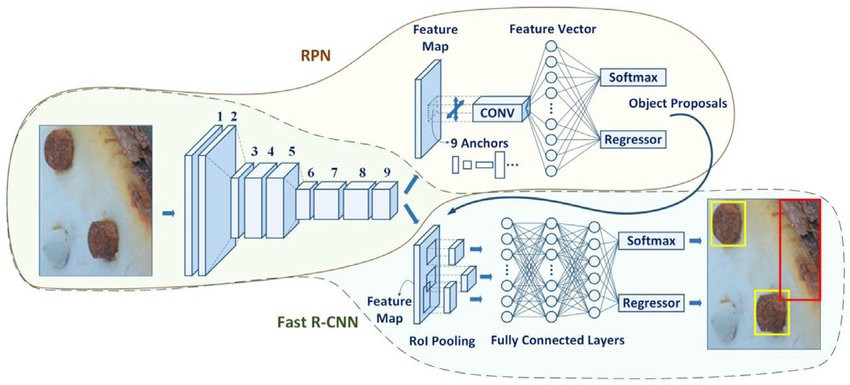

### Object-Detection
It is a technique of computer vision and image processing that deals with detecting instances of semantic objects of a certain class such as humans, buildings and cars in digital images and videos.
### Requirements
* Keras 2.x
* Python 3.x
* Tensorflow 1.x
### Folder Structure
├── __Code__     
│ &nbsp;&nbsp;&nbsp;&nbsp;&nbsp;&nbsp;&nbsp;&nbsp;└── UNET.ipynb  
│ &nbsp;&nbsp;&nbsp;&nbsp;&nbsp;&nbsp;&nbsp;&nbsp;└── Segnet.ipynb    
│ &nbsp;&nbsp;&nbsp;&nbsp;&nbsp;&nbsp;&nbsp;&nbsp;└── DeepLabv3plus.ipynb    
├── __Model__    
│ &nbsp;&nbsp;&nbsp;&nbsp;&nbsp;&nbsp;&nbsp;&nbsp;└── model-unet.h5  
│ &nbsp;&nbsp;&nbsp;&nbsp;&nbsp;&nbsp;&nbsp;&nbsp;└── model-Segnet.h5  
│ &nbsp;&nbsp;&nbsp;&nbsp;&nbsp;&nbsp;&nbsp;&nbsp;└── trained model has been found on this [link](https://drive.google.com/open?id=1a0CLd8xXJPXycNkgaBVSHuIYu03txPlD)  
├── __Network Summary__   
│ &nbsp;&nbsp;&nbsp;&nbsp;&nbsp;&nbsp;&nbsp;&nbsp;└── Unet.txt  
│ &nbsp;&nbsp;&nbsp;&nbsp;&nbsp;&nbsp;&nbsp;&nbsp;└── Segnet.txt    
│ &nbsp;&nbsp;&nbsp;&nbsp;&nbsp;&nbsp;&nbsp;&nbsp;└── DeepLabv3plus.txt    
### Dataset 
Satellite Imagery Multi-vehicles Dataset (SIMD). It comprises 5,000 images of resolution 1024 x 768 and collectively contains 45,303 objects in 15 different classes of vehicles including cars,
trucks, buses, long vehicles, various types of aircrafts and boats. The source images are taken from public satellite imagery available in Google Earth and contain images of multiple locations from seven countries.
### 1. Faster RCNN

### 2. RetinaNet RCNN

### 3. YOLOV3

